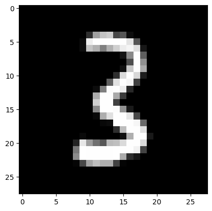

<a href="https://colab.research.google.com/github/yowashi23/miniai/blob/main/nbs/04_minibatch_training.ipynb" target="_parent"></a>

<!-- WARNING: THIS FILE WAS AUTOGENERATED! DO NOT EDIT! -->

``` python
# !pip install nbdev
```

    Requirement already satisfied: nbdev in /usr/local/lib/python3.12/dist-packages (3.0.12)
    Requirement already satisfied: fastcore>=1.12.3 in /usr/local/lib/python3.12/dist-packages (from nbdev) (1.12.26)
    Requirement already satisfied: execnb>=0.1.12 in /usr/local/lib/python3.12/dist-packages (from nbdev) (0.1.18)
    Requirement already satisfied: astunparse in /usr/local/lib/python3.12/dist-packages (from nbdev) (1.6.3)
    Requirement already satisfied: ghapi>=1.0.3 in /usr/local/lib/python3.12/dist-packages (from nbdev) (1.0.13)
    Requirement already satisfied: watchdog in /usr/local/lib/python3.12/dist-packages (from nbdev) (6.0.0)
    Requirement already satisfied: asttokens in /usr/local/lib/python3.12/dist-packages (from nbdev) (3.0.1)
    Requirement already satisfied: setuptools in /usr/local/lib/python3.12/dist-packages (from nbdev) (75.2.0)
    Requirement already satisfied: build in /usr/local/lib/python3.12/dist-packages (from nbdev) (1.4.0)
    Requirement already satisfied: fastgit in /usr/local/lib/python3.12/dist-packages (from nbdev) (0.0.4)
    Requirement already satisfied: pyyaml in /usr/local/lib/python3.12/dist-packages (from nbdev) (6.0.3)
    Requirement already satisfied: ipython in /usr/local/lib/python3.12/dist-packages (from execnb>=0.1.12->nbdev) (7.34.0)
    Requirement already satisfied: wheel<1.0,>=0.23.0 in /usr/local/lib/python3.12/dist-packages (from astunparse->nbdev) (0.46.3)
    Requirement already satisfied: six<2.0,>=1.6.1 in /usr/local/lib/python3.12/dist-packages (from astunparse->nbdev) (1.17.0)
    Requirement already satisfied: packaging>=24.0 in /usr/local/lib/python3.12/dist-packages (from build->nbdev) (26.0)
    Requirement already satisfied: pyproject_hooks in /usr/local/lib/python3.12/dist-packages (from build->nbdev) (1.2.0)
    Requirement already satisfied: jedi>=0.16 in /usr/local/lib/python3.12/dist-packages (from ipython->execnb>=0.1.12->nbdev) (0.19.2)
    Requirement already satisfied: decorator in /usr/local/lib/python3.12/dist-packages (from ipython->execnb>=0.1.12->nbdev) (4.4.2)
    Requirement already satisfied: pickleshare in /usr/local/lib/python3.12/dist-packages (from ipython->execnb>=0.1.12->nbdev) (0.7.5)
    Requirement already satisfied: traitlets>=4.2 in /usr/local/lib/python3.12/dist-packages (from ipython->execnb>=0.1.12->nbdev) (5.7.1)
    Requirement already satisfied: prompt-toolkit!=3.0.0,!=3.0.1,<3.1.0,>=2.0.0 in /usr/local/lib/python3.12/dist-packages (from ipython->execnb>=0.1.12->nbdev) (3.0.52)
    Requirement already satisfied: pygments in /usr/local/lib/python3.12/dist-packages (from ipython->execnb>=0.1.12->nbdev) (2.19.2)
    Requirement already satisfied: backcall in /usr/local/lib/python3.12/dist-packages (from ipython->execnb>=0.1.12->nbdev) (0.2.0)
    Requirement already satisfied: matplotlib-inline in /usr/local/lib/python3.12/dist-packages (from ipython->execnb>=0.1.12->nbdev) (0.2.1)
    Requirement already satisfied: pexpect>4.3 in /usr/local/lib/python3.12/dist-packages (from ipython->execnb>=0.1.12->nbdev) (4.9.0)
    Requirement already satisfied: parso<0.9.0,>=0.8.4 in /usr/local/lib/python3.12/dist-packages (from jedi>=0.16->ipython->execnb>=0.1.12->nbdev) (0.8.6)
    Requirement already satisfied: ptyprocess>=0.5 in /usr/local/lib/python3.12/dist-packages (from pexpect>4.3->ipython->execnb>=0.1.12->nbdev) (0.7.0)
    Requirement already satisfied: wcwidth in /usr/local/lib/python3.12/dist-packages (from prompt-toolkit!=3.0.0,!=3.0.1,<3.1.0,>=2.0.0->ipython->execnb>=0.1.12->nbdev) (0.6.0)

``` python
# !nbdev-install-quarto
```

``` python
# !pip install jupyterlab-quarto
```

``` python
!git clone https://github.com/yowashi23/miniai.git
```

    Cloning into 'miniai'...
    warning: You appear to have cloned an empty repository.

``` python
!cd miniai
```

``` python
!nbdev-new --user yowashi23 --author yowashi23 --author_email shin.yongwhan23@gmail.com
```

    pyproject.toml created.
    No git repo found. Run: gh repo create yowashi23/content --public --source=.
    pandoc -o README.md
      to: >-
        commonmark+autolink_bare_uris+emoji+footnotes+gfm_auto_identifiers+pipe_tables+strikeout+task_lists+tex_math_dollars
      output-file: index.html
      standalone: true
      default-image-extension: png
      variables: {}
      
    metadata
      engines:
        - path: /opt/quarto/share/extension-subtrees/julia-engine/_extensions/julia-engine/julia-engine.js
      title: content
      
    Output created: _docs/README.md

``` python
MNIST_URL='https://github.com/mnielsen/neural-networks-and-deep-learning/blob/master/data/mnist.pkl.gz?raw=true'
path_data = Path('data')
path_data.mkdir(exist_ok=True)
path_gz = path_data/'mnist.pkl.gz'

from urllib.request import urlretrieve
if not path_gz.exists(): urlretrieve(MNIST_URL, path_gz)
```

``` python
from fastcore.test import test_close

torch.set_printoptions(precision=2, linewidth=140, sci_mode=False)
torch.manual_seed(1)
mpl.rcParams['image.cmap'] = 'gray'

path_data = Path('data')
path_gz = path_data/'mnist.pkl.gz'
with gzip.open(path_gz, 'rb') as f: ((x_train, y_train), (x_valid, y_valid), _) = pickle.load(f, encoding='latin-1')
x_train, y_train, x_valid, y_valid = map(tensor, [x_train, y_train, x_valid, y_valid])
```

    VisibleDeprecationWarning: dtype(): align should be passed as Python or NumPy boolean but got `align=0`. Did you mean to pass a tuple to create a subarray type? (Deprecated NumPy 2.4)
      with gzip.open(path_gz, 'rb') as f: ((x_train, y_train), (x_valid, y_valid), _) = pickle.load(f, encoding='latin-1')

## Initial setup

### Data

``` python
n,m = x_train.shape
c = y_train.max()+1
nh = 50
```

``` python
class Model(nn.Module):
    def __init__(self, n_in, nh, n_out):
        super().__init__()
        self.layers = [nn.Linear(n_in,nh), nn.ReLU(), nn.Linear(nh,n_out)]

    def __call__(self, x):
        for l in self.layers: x = l(x)
        return x
```

``` python
model = Model(m, nh, 10)
pred = model(x_train)
pred.shape
```

    torch.Size([50000, 10])

### Cross entropy loss

First, we will need to compute the softmax of our activations. This is
defined by:

$$\hbox{softmax(x)}\_{i} = \frac{e^{x\_{i}}}{e^{x\_{0}} + e^{x\_{1}} + \cdots + e^{x\_{n-1}}}$$

or more concisely:

$$\hbox{softmax(x)}\_{i} = \frac{e^{x\_{i}}}{\sum\limits\_{0 \leq j \lt n} e^{x\_{j}}}$$

In practice, we will need the log of the softmax when we calculate the
loss.

``` python
def log_softmax(x): return (x.exp()/(x.exp().sum(-1,keepdim=True))).log()
```

``` python
log_softmax(pred)
```

    tensor([[-2.37, -2.49, -2.36,  ..., -2.31, -2.28, -2.22],
            [-2.37, -2.44, -2.44,  ..., -2.27, -2.26, -2.16],
            [-2.48, -2.33, -2.28,  ..., -2.30, -2.30, -2.27],
            ...,
            [-2.33, -2.52, -2.34,  ..., -2.31, -2.21, -2.16],
            [-2.38, -2.38, -2.33,  ..., -2.29, -2.26, -2.17],
            [-2.33, -2.55, -2.36,  ..., -2.29, -2.27, -2.16]], grad_fn=<LogBackward0>)

Note that the formula

$$\log \left ( \frac{a}{b} \right ) = \log(a) - \log(b)$$

gives a simplification when we compute the log softmax:

``` python
def log_softmax(x): return x - x.exp().sum(-1,keepdim=True).log()
```

Then, there is a way to compute the log of the sum of exponentials in a
more stable way, called the [LogSumExp
trick](https://en.wikipedia.org/wiki/LogSumExp). The idea is to use the
following formula:

$$\log \left ( \sum\_{j=1}^{n} e^{x\_{j}} \right ) = \log \left ( e^{a} \sum\_{j=1}^{n} e^{x\_{j}-a} \right ) = a + \log \left ( \sum\_{j=1}^{n} e^{x\_{j}-a} \right )$$

where a is the maximum of the *x*<sub>*j*</sub>.

``` python
def logsumexp(x):
    m = x.max(-1)[0]
    return m + (x-m[:,None]).exp().sum(-1).log()
```

This way, we will avoid an overflow when taking the exponential of a big
activation. In PyTorch, this is already implemented for us.

``` python
def log_softmax(x): return x - x.logsumexp(-1,keepdim=True)
```

``` python
test_close(logsumexp(pred), pred.logsumexp(-1))
sm_pred = log_softmax(pred)
sm_pred
```

    tensor([[-2.37, -2.49, -2.36,  ..., -2.31, -2.28, -2.22],
            [-2.37, -2.44, -2.44,  ..., -2.27, -2.26, -2.16],
            [-2.48, -2.33, -2.28,  ..., -2.30, -2.30, -2.27],
            ...,
            [-2.33, -2.52, -2.34,  ..., -2.31, -2.21, -2.16],
            [-2.38, -2.38, -2.33,  ..., -2.29, -2.26, -2.17],
            [-2.33, -2.55, -2.36,  ..., -2.29, -2.27, -2.16]], grad_fn=<SubBackward0>)

The cross entropy loss for some target *x* and some prediction *p*(*x*)
is given by:

−∑*x* log *p*(*x*)

But since our *x*s are 1-hot encoded (actually, they’re just the integer
indices), this can be rewritten as −log (*p*<sub>*i*</sub>) where i is
the index of the desired target.

This can be done using numpy-style [integer array
indexing](https://docs.scipy.org/doc/numpy-1.13.0/reference/arrays.indexing.html#integer-array-indexing).
Note that PyTorch supports all the tricks in the advanced indexing
methods discussed in that link.

``` python
y_train[:3]
```

    tensor([5, 0, 4])

``` python
y_train.shape
```

    torch.Size([50000])

``` python
sm_pred[0,5],sm_pred[1,0],sm_pred[2,4]
```

    (tensor(-2.20, grad_fn=<SelectBackward0>),
     tensor(-2.37, grad_fn=<SelectBackward0>),
     tensor(-2.36, grad_fn=<SelectBackward0>))

``` python
sm_pred.shape
```

    torch.Size([50000, 10])

``` python
sm_pred[[0,1,2], y_train[:3]]
```

    tensor([-2.20, -2.37, -2.36], grad_fn=<IndexBackward0>)

``` python
def nll(input, target): return -input[range(target.shape[0]), target].mean()
```

``` python
loss = nll(sm_pred, y_train)
loss
```

    tensor(2.30, grad_fn=<NegBackward0>)

Then use PyTorch’s implementation.

``` python
test_close(F.nll_loss(F.log_softmax(pred, -1), y_train), loss, 1e-3)
```

In PyTorch, `F.log_softmax` and `F.nll_loss` are combined in one
optimized function, `F.cross_entropy`.

``` python
test_close(F.cross_entropy(pred, y_train), loss, 1e-3)
```

## Basic training loop

Basically the training loop repeats over the following steps: - get the
output of the model on a batch of inputs - compare the output to the
labels we have and compute a loss - calculate the gradients of the loss
with respect to every parameter of the model - update said parameters
with those gradients to make them a little bit better

``` python
loss_func = F.cross_entropy
```

``` python
bs=50                  # batch size

xb = x_train[0:bs]     # a mini-batch from x
preds = model(xb)      # predictions
preds[0], preds.shape
```

    (tensor([-0.09, -0.21, -0.08,  0.10, -0.04,  0.08, -0.04, -0.03,  0.01,  0.06], grad_fn=<SelectBackward0>),
     torch.Size([50, 10]))

``` python
yb = y_train[0:bs]
yb
```

    tensor([5, 0, 4, 1, 9, 2, 1, 3, 1, 4, 3, 5, 3, 6, 1, 7, 2, 8, 6, 9, 4, 0, 9, 1, 1, 2, 4, 3, 2, 7, 3, 8, 6, 9, 0, 5, 6, 0, 7, 6, 1, 8, 7, 9,
            3, 9, 8, 5, 9, 3])

``` python
loss_func(preds, yb)
```

    tensor(2.30, grad_fn=<NllLossBackward0>)

``` python
preds.argmax(dim=1)
```

    tensor([3, 9, 3, 8, 5, 9, 3, 9, 3, 9, 5, 3, 9, 9, 3, 9, 9, 5, 8, 7, 9, 5, 3, 8, 9, 5, 9, 5, 5, 9, 3, 5, 9, 7, 5, 7, 9, 9, 3, 9, 3, 5, 3, 8,
            3, 5, 9, 5, 9, 5])

------------------------------------------------------------------------

<a
href="https://github.com/yowashi23/miniai/blob/main/miniai/training.py#L13"
target="_blank" style="float:right; font-size:smaller">source</a>

### accuracy

``` python

def accuracy(
    out, yb
):

```

*Call self as a function.*

``` python
accuracy(preds, yb)
```

    tensor(0.08)

``` python
lr = 0.5   # learning rate
epochs = 3 # how many epochs to train for
```

------------------------------------------------------------------------

<a
href="https://github.com/yowashi23/miniai/blob/main/miniai/training.py#L16"
target="_blank" style="float:right; font-size:smaller">source</a>

### report

``` python

def report(
    loss, preds, yb
):

```

*Call self as a function.*

``` python
xb,yb = x_train[:bs],y_train[:bs]
preds = model(xb)
report(loss_func(preds, yb), preds, yb)
```

    2.30, 0.08

``` python
for epoch in range(epochs):
    for i in range(0, n, bs):
        s = slice(i, min(n,i+bs))
        xb,yb = x_train[s],y_train[s]
        preds = model(xb)
        loss = loss_func(preds, yb)
        loss.backward()
        with torch.no_grad():
            for l in model.layers:
                if hasattr(l, 'weight'):
                    l.weight -= l.weight.grad * lr
                    l.bias   -= l.bias.grad   * lr
                    l.weight.grad.zero_()
                    l.bias  .grad.zero_()
    report(loss, preds, yb)
```

    0.12, 0.98
    0.12, 0.94
    0.08, 0.96

## Using parameters and optim

### Parameters

``` python
m1 = nn.Module()
m1.foo = nn.Linear(3,4)
m1
```

    Module(
      (foo): Linear(in_features=3, out_features=4, bias=True)
    )

``` python
list(m1.named_children())
```

    [('foo', Linear(in_features=3, out_features=4, bias=True))]

``` python
m1.named_children()
```

    <generator object Module.named_children>

``` python
list(m1.parameters())
```

    [Parameter containing:
     tensor([[ 0.57,  0.43, -0.30],
             [ 0.13, -0.32, -0.24],
             [ 0.51,  0.04,  0.22],
             [ 0.13, -0.17, -0.24]], requires_grad=True),
     Parameter containing:
     tensor([-0.01, -0.51, -0.39,  0.56], requires_grad=True)]

``` python
class MLP(nn.Module):
    def __init__(self, n_in, nh, n_out):
        super().__init__()
        self.l1 = nn.Linear(n_in,nh)
        self.l2 = nn.Linear(nh,n_out)
        self.relu = nn.ReLU()

    def forward(self, x): return self.l2(self.relu(self.l1(x)))
```

``` python
model = MLP(m, nh, 10)
model.l1
```

    Linear(in_features=784, out_features=50, bias=True)

``` python
model
```

    MLP(
      (l1): Linear(in_features=784, out_features=50, bias=True)
      (l2): Linear(in_features=50, out_features=10, bias=True)
      (relu): ReLU()
    )

``` python
for name,l in model.named_children(): print(f"{name}: {l}")
```

    l1: Linear(in_features=784, out_features=50, bias=True)
    l2: Linear(in_features=50, out_features=10, bias=True)
    relu: ReLU()

``` python
for p in model.parameters(): print(p.shape)
```

    torch.Size([50, 784])
    torch.Size([50])
    torch.Size([10, 50])
    torch.Size([10])

``` python
def fit():
    for epoch in range(epochs):
        for i in range(0, n, bs):
            s = slice(i, min(n,i+bs))
            xb,yb = x_train[s],y_train[s]
            preds = model(xb)
            loss = loss_func(preds, yb)
            loss.backward()
            with torch.no_grad():
                for p in model.parameters(): p -= p.grad * lr
                model.zero_grad()
        report(loss, preds, yb)
```

``` python
fit()
```

    0.19, 0.96
    0.11, 0.96
    0.04, 1.00

Behind the scenes, PyTorch overrides the `__setattr__` function in
`nn.Module` so that the submodules you define are properly registered as
parameters of the model.

``` python
class MyModule:
    def __init__(self, n_in, nh, n_out):
        self._modules = {}
        self.l1 = nn.Linear(n_in,nh)
        self.l2 = nn.Linear(nh,n_out)

    def __setattr__(self,k,v):
        if not k.startswith("_"): self._modules[k] = v
        super().__setattr__(k,v)

    def __repr__(self): return f'{self._modules}'

    def parameters(self):
        for l in self._modules.values(): yield from l.parameters()
```

``` python
mdl = MyModule(m,nh,10)
mdl
```

    {'l1': Linear(in_features=784, out_features=50, bias=True), 'l2': Linear(in_features=50, out_features=10, bias=True)}

``` python
for p in mdl.parameters(): print(p.shape)
```

    torch.Size([50, 784])
    torch.Size([50])
    torch.Size([10, 50])
    torch.Size([10])

### Registering modules

``` python
from functools import reduce
```

We can use the original `layers` approach, but we have to register the
modules.

``` python
layers = [nn.Linear(m,nh), nn.ReLU(), nn.Linear(nh,10)]
```

``` python
class Model(nn.Module):
    def __init__(self, layers):
        super().__init__()
        self.layers = layers
        for i,l in enumerate(self.layers): self.add_module(f'layer_{i}', l)

    def forward(self, x): return reduce(lambda val,layer: layer(val), self.layers, x)
```

``` python
model = Model(layers)
model
```

    Model(
      (layer_0): Linear(in_features=784, out_features=50, bias=True)
      (layer_1): ReLU()
      (layer_2): Linear(in_features=50, out_features=10, bias=True)
    )

``` python
model(xb).shape
```

    torch.Size([50, 10])

### nn.ModuleList

`nn.ModuleList` does this for us.

``` python
class SequentialModel(nn.Module):
    def __init__(self, layers):
        super().__init__()
        self.layers = nn.ModuleList(layers)

    def forward(self, x):
        for l in self.layers: x = l(x)
        return x
```

``` python
model = SequentialModel(layers)
model
```

    SequentialModel(
      (layers): ModuleList(
        (0): Linear(in_features=784, out_features=50, bias=True)
        (1): ReLU()
        (2): Linear(in_features=50, out_features=10, bias=True)
      )
    )

``` python
fit()
```

    0.12, 0.96
    0.11, 0.96
    0.07, 0.98

### nn.Sequential

`nn.Sequential` is a convenient class which does the same as the above:

``` python
model = nn.Sequential(nn.Linear(m,nh), nn.ReLU(), nn.Linear(nh,10))
```

``` python
fit()
loss_func(model(xb), yb), accuracy(model(xb), yb)
```

    0.15, 0.96
    0.11, 0.96
    0.09, 0.94

    (tensor(0.02, grad_fn=<NllLossBackward0>), tensor(1.))

``` python
model
```

    Sequential(
      (0): Linear(in_features=784, out_features=50, bias=True)
      (1): ReLU()
      (2): Linear(in_features=50, out_features=10, bias=True)
    )

### optim

``` python
class Optimizer():
    def __init__(self, params, lr=0.5): self.params,self.lr=list(params),lr

    def step(self):
        with torch.no_grad():
            for p in self.params: p -= p.grad * self.lr

    def zero_grad(self):
        for p in self.params: p.grad.data.zero_()
```

``` python
model = nn.Sequential(nn.Linear(m,nh), nn.ReLU(), nn.Linear(nh,10))
```

``` python
opt = Optimizer(model.parameters())
```

``` python
for epoch in range(epochs):
    for i in range(0, n, bs):
        s = slice(i, min(n,i+bs))
        xb,yb = x_train[s],y_train[s]
        preds = model(xb)
        loss = loss_func(preds, yb)
        loss.backward()
        opt.step()
        opt.zero_grad()
    report(loss, preds, yb)
```

    0.18, 0.94
    0.13, 0.96
    0.11, 0.94

PyTorch already provides this exact functionality in `optim.SGD` (it
also handles stuff like momentum, which we’ll look at later)

``` python
from torch import optim
```

``` python
def get_model():
    model = nn.Sequential(nn.Linear(m,nh), nn.ReLU(), nn.Linear(nh,10))
    return model, optim.SGD(model.parameters(), lr=lr)
```

``` python
model,opt = get_model()
loss_func(model(xb), yb)
```

    tensor(2.33, grad_fn=<NllLossBackward0>)

``` python
for epoch in range(epochs):
    for i in range(0, n, bs):
        s = slice(i, min(n,i+bs))
        xb,yb = x_train[s],y_train[s]
        preds = model(xb)
        loss = loss_func(preds, yb)
        loss.backward()
        opt.step()
        opt.zero_grad()
    report(loss, preds, yb)
```

    0.12, 0.98
    0.09, 0.98
    0.07, 0.98

## Dataset and DataLoader

### Dataset

It’s clunky to iterate through minibatches of x and y values separately:

``` python
    xb = x_train[s]
    yb = y_train[s]
```

Instead, let’s do these two steps together, by introducing a
[`Dataset`](https://yowashi23.github.io/miniai/minibatch_training.html#dataset)
class:

``` python
    xb,yb = train_ds[s]
```

------------------------------------------------------------------------

<a
href="https://github.com/yowashi23/miniai/blob/main/miniai/training.py#L19"
target="_blank" style="float:right; font-size:smaller">source</a>

### Dataset

``` python

def Dataset(
    x, y
):

```

*Initialize self. See help(type(self)) for accurate signature.*

``` python
train_ds,valid_ds = Dataset(x_train, y_train),Dataset(x_valid, y_valid)
assert len(train_ds)==len(x_train)
assert len(valid_ds)==len(x_valid)
```

``` python
xb,yb = train_ds[0:5]
assert xb.shape==(5,28*28)
assert yb.shape==(5,)
xb,yb
```

    (tensor([[0., 0., 0.,  ..., 0., 0., 0.],
             [0., 0., 0.,  ..., 0., 0., 0.],
             [0., 0., 0.,  ..., 0., 0., 0.],
             [0., 0., 0.,  ..., 0., 0., 0.],
             [0., 0., 0.,  ..., 0., 0., 0.]]),
     tensor([5, 0, 4, 1, 9]))

``` python
model,opt = get_model()
```

``` python
for epoch in range(epochs):
    for i in range(0, n, bs):
        xb,yb = train_ds[i:min(n,i+bs)]
        preds = model(xb)
        loss = loss_func(preds, yb)
        loss.backward()
        opt.step()
        opt.zero_grad()
    report(loss, preds, yb)
```

    0.17, 0.96
    0.11, 0.94
    0.09, 0.96

### DataLoader

Previously, our loop iterated over batches (xb, yb) like this:

``` python
for i in range(0, n, bs):
    xb,yb = train_ds[i:min(n,i+bs)]
    ...
```

Let’s make our loop much cleaner, using a data loader:

``` python
for xb,yb in train_dl:
    ...
```

``` python
class DataLoader():
    def __init__(self, ds, bs): self.ds,self.bs = ds,bs
    def __iter__(self):
        for i in range(0, len(self.ds), self.bs): yield self.ds[i:i+self.bs]
```

``` python
train_dl = DataLoader(train_ds, bs)
valid_dl = DataLoader(valid_ds, bs)
```

``` python
xb,yb = next(iter(valid_dl))
xb.shape
```

    torch.Size([50, 784])

``` python
yb
```

    tensor([3, 8, 6, 9, 6, 4, 5, 3, 8, 4, 5, 2, 3, 8, 4, 8, 1, 5, 0, 5, 9, 7, 4, 1, 0, 3, 0, 6, 2, 9, 9, 4, 1, 3, 6, 8, 0, 7, 7, 6, 8, 9, 0, 3,
            8, 3, 7, 7, 8, 4])

``` python
plt.imshow(xb[0].view(28,28))
yb[0]
```

    tensor(3)



``` python
model,opt = get_model()
```

``` python
def fit():
    for epoch in range(epochs):
        for xb,yb in train_dl:
            preds = model(xb)
            loss = loss_func(preds, yb)
            loss.backward()
            opt.step()
            opt.zero_grad()
        report(loss, preds, yb)
```

``` python
fit()
loss_func(model(xb), yb), accuracy(model(xb), yb)
```

    0.11, 0.98
    0.09, 0.98
    0.06, 1.00

    (tensor(0.03, grad_fn=<NllLossBackward0>), tensor(1.))

### Random sampling

We want our training set to be in a random order, and that order should
differ each iteration. But the validation set shouldn’t be randomized.

``` python
import random
```

``` python
class Sampler():
    def __init__(self, ds, shuffle=False): self.n,self.shuffle = len(ds),shuffle
    def __iter__(self):
        res = list(range(self.n))
        if self.shuffle: random.shuffle(res)
        return iter(res)
```

``` python
from itertools import islice
```

``` python
ss = Sampler(train_ds)
```

``` python
it = iter(ss)
for o in range(5): print(next(it))
```

    0
    1
    2
    3
    4

``` python
list(islice(ss, 5))
```

    [0, 1, 2, 3, 4]

``` python
ss = Sampler(train_ds, shuffle=True)
list(islice(ss, 5))
```

    [9479, 15594, 48548, 36621, 15204]

``` python
import fastcore.all as fc
```

``` python
class BatchSampler():
    def __init__(self, sampler, bs, drop_last=False): fc.store_attr()
    def __iter__(self): yield from fc.chunked(iter(self.sampler), self.bs, drop_last=self.drop_last)
```

``` python
batchs = BatchSampler(ss, 4)
list(islice(batchs, 5))
```

    [[37946, 23040, 42943, 49787],
     [19388, 29565, 4599, 22490],
     [1415, 23053, 5454, 35732],
     [46409, 36545, 48757, 12439],
     [15242, 42724, 42850, 36010]]

``` python
def collate(b):
    xs,ys = zip(*b)
    return torch.stack(xs),torch.stack(ys)
```

``` python
class DataLoader():
    def __init__(self, ds, batchs, collate_fn=collate): fc.store_attr()
    def __iter__(self): yield from (self.collate_fn(self.ds[i] for i in b) for b in self.batchs)
```

``` python
train_samp = BatchSampler(Sampler(train_ds, shuffle=True ), bs)
valid_samp = BatchSampler(Sampler(valid_ds, shuffle=False), bs)
```

``` python
train_dl = DataLoader(train_ds, batchs=train_samp)
valid_dl = DataLoader(valid_ds, batchs=valid_samp)
```

``` python
xb,yb = next(iter(valid_dl))
plt.imshow(xb[0].view(28,28))
yb[0]
```

    tensor(3)


``` python
xb.shape,yb.shape
```

    (torch.Size([50, 784]), torch.Size([50]))

``` python
model,opt = get_model()
```

``` python
fit()
```

    0.12, 0.94
    0.15, 0.92
    0.16, 0.92

### Multiprocessing DataLoader

``` python
import torch.multiprocessing as mp
from fastcore.basics import store_attr
```

``` python
train_ds[[3,6,8,1]]
```

    (tensor([[0., 0., 0.,  ..., 0., 0., 0.],
             [0., 0., 0.,  ..., 0., 0., 0.],
             [0., 0., 0.,  ..., 0., 0., 0.],
             [0., 0., 0.,  ..., 0., 0., 0.]]),
     tensor([1, 1, 1, 0]))

``` python
train_ds.__getitem__([3,6,8,1])
```

    (tensor([[0., 0., 0.,  ..., 0., 0., 0.],
             [0., 0., 0.,  ..., 0., 0., 0.],
             [0., 0., 0.,  ..., 0., 0., 0.],
             [0., 0., 0.,  ..., 0., 0., 0.]]),
     tensor([1, 1, 1, 0]))

``` python
for o in map(train_ds.__getitem__, ([3,6],[8,1])): print(o)
```

    (tensor([[0., 0., 0.,  ..., 0., 0., 0.],
            [0., 0., 0.,  ..., 0., 0., 0.]]), tensor([1, 1]))
    (tensor([[0., 0., 0.,  ..., 0., 0., 0.],
            [0., 0., 0.,  ..., 0., 0., 0.]]), tensor([1, 0]))

``` python
class DataLoader():
    def __init__(self, ds, batchs, n_workers=1, collate_fn=collate): fc.store_attr()
    def __iter__(self):
        with mp.Pool(self.n_workers) as ex: yield from ex.map(self.ds.__getitem__, iter(self.batchs))
```

``` python
train_dl = DataLoader(train_ds, batchs=train_samp, n_workers=2)
it = iter(train_dl)
```

``` python
xb,yb = next(it)
xb.shape,yb.shape
```

    (torch.Size([50, 784]), torch.Size([50]))

### PyTorch DataLoader

``` python
train_samp = BatchSampler(RandomSampler(train_ds),     bs, drop_last=False)
valid_samp = BatchSampler(SequentialSampler(valid_ds), bs, drop_last=False)
```

``` python
train_dl = DataLoader(train_ds, batch_sampler=train_samp, collate_fn=collate)
valid_dl = DataLoader(valid_ds, batch_sampler=valid_samp, collate_fn=collate)
```

``` python
model,opt = get_model()
fit()
loss_func(model(xb), yb), accuracy(model(xb), yb)
```

    0.10, 0.94
    0.10, 0.96
    0.27, 0.98

    (tensor(0.01, grad_fn=<NllLossBackward0>), tensor(1.))

PyTorch can auto-generate the BatchSampler for us:

``` python
train_dl = DataLoader(train_ds, bs, sampler=RandomSampler(train_ds), collate_fn=collate)
valid_dl = DataLoader(valid_ds, bs, sampler=SequentialSampler(valid_ds), collate_fn=collate)
```

PyTorch can also generate the Sequential/RandomSamplers too:

``` python
train_dl = DataLoader(train_ds, bs, shuffle=True, drop_last=True, num_workers=2)
valid_dl = DataLoader(valid_ds, bs, shuffle=False, num_workers=2)
```

``` python
model,opt = get_model()
fit()

loss_func(model(xb), yb), accuracy(model(xb), yb)
```

    0.21, 0.92
    0.15, 0.94
    0.05, 0.98

    (tensor(0.05, grad_fn=<NllLossBackward0>), tensor(0.98))

Our dataset actually already knows how to sample a batch of indices all
at once:

``` python
train_ds[[4,6,7]]
```

    (tensor([[0., 0., 0.,  ..., 0., 0., 0.],
             [0., 0., 0.,  ..., 0., 0., 0.],
             [0., 0., 0.,  ..., 0., 0., 0.]]),
     tensor([9, 1, 3]))

…that means that we can actually skip the batch_sampler and collate_fn
entirely:

``` python
train_dl = DataLoader(train_ds, sampler=train_samp)
valid_dl = DataLoader(valid_ds, sampler=valid_samp)
```

``` python
xb,yb = next(iter(train_dl))
xb.shape,yb.shape
```

    (torch.Size([1, 50, 784]), torch.Size([1, 50]))

## Validation

You **always** should also have a [validation
set](http://www.fast.ai/2017/11/13/validation-sets/), in order to
identify if you are overfitting.

We will calculate and print the validation loss at the end of each
epoch.

(Note that we always call `model.train()` before training, and
`model.eval()` before inference, because these are used by layers such
as `nn.BatchNorm2d` and `nn.Dropout` to ensure appropriate behaviour for
these different phases.)

------------------------------------------------------------------------

<a
href="https://github.com/yowashi23/miniai/blob/main/miniai/training.py#L28"
target="_blank" style="float:right; font-size:smaller">source</a>

### fit

``` python

def fit(
    epochs, model, loss_func, opt, train_dl, valid_dl
):

```

*Call self as a function.*

------------------------------------------------------------------------

<a
href="https://github.com/yowashi23/miniai/blob/main/miniai/training.py#L50"
target="_blank" style="float:right; font-size:smaller">source</a>

### get_dls

``` python

def get_dls(
    train_ds, valid_ds, bs, kwargs:VAR_KEYWORD
):

```

*Call self as a function.*

Now, our whole process of obtaining the data loaders and fitting the
model can be run in 3 lines of code:

``` python
train_dl,valid_dl = get_dls(train_ds, valid_ds, bs)
model,opt = get_model()
```

``` python
```

    0 0.14236383073031902 0.958100004196167
    1 0.12564024675637483 0.9632000041007995
    2 0.1306914600916207 0.9645000052452087
    3 0.1098845548601821 0.9670000064373017
    4 0.11636366279795766 0.9678000068664551
    CPU times: user 6.58 s, sys: 7.61 ms, total: 6.58 s
    Wall time: 6.66 s
