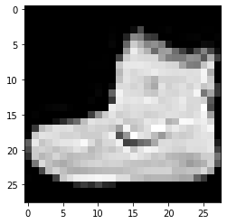
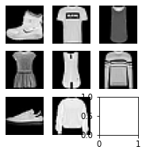
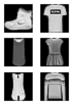
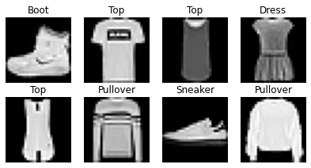

<a href="https://colab.research.google.com/github/yowashi23/miniai/blob/main/nbs/05_datasets.ipynb" target="_parent"></a>

<!-- WARNING: THIS FILE WAS AUTOGENERATED! DO NOT EDIT! -->

``` python
import logging,pickle,gzip,os,time,shutil,torch,matplotlib as mpl
from pathlib import Path

from torch import tensor,nn,optim
from torch.utils.data import DataLoader
import torch.nn.functional as F
from datasets import load_dataset,load_dataset_builder

import torchvision.transforms.functional as TF
from fastcore.test import test_close
```

``` python
torch.set_printoptions(precision=2, linewidth=140, sci_mode=False)
torch.manual_seed(1)
mpl.rcParams['image.cmap'] = 'gray'
```

``` python
logging.disable(logging.WARNING)
```

## Hugging Face Datasets

``` python
name = "fashion_mnist"
ds_builder = load_dataset_builder(name)
print(ds_builder.info.description)
```

    Fashion-MNIST is a dataset of Zalando's article images—consisting of a training set of
    60,000 examples and a test set of 10,000 examples. Each example is a 28x28 grayscale image,
    associated with a label from 10 classes. We intend Fashion-MNIST to serve as a direct drop-in
    replacement for the original MNIST dataset for benchmarking machine learning algorithms.
    It shares the same image size and structure of training and testing splits.

``` python
ds_builder.info.features
```

    {'image': Image(decode=True, id=None),
     'label': ClassLabel(num_classes=10, names=['T - shirt / top', 'Trouser', 'Pullover', 'Dress', 'Coat', 'Sandal', 'Shirt', 'Sneaker', 'Bag', 'Ankle boot'], id=None)}

``` python
ds_builder.info.splits
```

    {'train': SplitInfo(name='train', num_bytes=31296607, num_examples=60000, dataset_name='fashion_mnist'),
     'test': SplitInfo(name='test', num_bytes=5233810, num_examples=10000, dataset_name='fashion_mnist')}

``` python
dsd = load_dataset(name)
dsd
```

      0%|          | 0/2 [00:00<?, ?it/s]

    DatasetDict({
        train: Dataset({
            features: ['image', 'label'],
            num_rows: 60000
        })
        test: Dataset({
            features: ['image', 'label'],
            num_rows: 10000
        })
    })

``` python
train,test = dsd['train'],dsd['test']
train[0]
```

    {'image': <PIL.PngImagePlugin.PngImageFile image mode=L size=28x28>,
     'label': 9}

``` python
x,y = ds_builder.info.features
```

``` python
x,y
```

    ('image', 'label')

``` python
x,y = 'image','label'
img = train[0][x]
img
```


``` python
xb = train[:5][x]
yb = train[:5][y]
yb
```

    [9, 0, 0, 3, 0]

``` python
featy = train.features[y]
featy
```

    ClassLabel(num_classes=10, names=['T - shirt / top', 'Trouser', 'Pullover', 'Dress', 'Coat', 'Sandal', 'Shirt', 'Sneaker', 'Bag', 'Ankle boot'], id=None)

``` python
featy.int2str(yb)
```

    ['Ankle boot',
     'T - shirt / top',
     'T - shirt / top',
     'Dress',
     'T - shirt / top']

``` python
train['label'][:5]
```

    [9, 0, 0, 3, 0]

``` python
def collate_fn(b):
    return {x:torch.stack([TF.to_tensor(o[x]) for o in b]),
            y:tensor([o[y] for o in b])}
```

``` python
dl = DataLoader(train, collate_fn=collate_fn, batch_size=16)
b = next(iter(dl))
b[x].shape,b[y]
```

    (torch.Size([16, 1, 28, 28]),
     tensor([9, 0, 0, 3, 0, 2, 7, 2, 5, 5, 0, 9, 5, 5, 7, 9]))

``` python
def transforms(b):
    b[x] = [TF.to_tensor(o) for o in b[x]]
    return b
```

``` python
tds = train.with_transform(transforms)
dl = DataLoader(tds, batch_size=16)
b = next(iter(dl))
b[x].shape,b[y]
```

    (torch.Size([16, 1, 28, 28]),
     tensor([9, 0, 0, 3, 0, 2, 7, 2, 5, 5, 0, 9, 5, 5, 7, 9]))

``` python
def _transformi(b): b[x] = [torch.flatten(TF.to_tensor(o)) for o in b[x]]
```

------------------------------------------------------------------------

<a
href="https://github.com/yowashi23/miniai/blob/main/miniai/datasets.py#L18"
target="_blank" style="float:right; font-size:smaller">source</a>

### inplace

``` python

def inplace(
    f
):

```

*Call self as a function.*

``` python
transformi = inplace(_transformi)
```

``` python
r = train.with_transform(transformi)[0]
r[x].shape,r[y]
```

    (torch.Size([784]), 9)

``` python
@inplace
def transformi(b): b[x] = [torch.flatten(TF.to_tensor(o)) for o in b[x]]
```

``` python
tdsf = train.with_transform(transformi)
r = tdsf[0]
r[x].shape,r[y]
```

    (torch.Size([784]), 9)

``` python
d = dict(a=1,b=2,c=3)
ig = itemgetter('a','c')
ig(d)
```

    (1, 3)

``` python
class D:
    def __getitem__(self, k): return 1 if k=='a' else 2 if k=='b' else 3
```

``` python
d = D()
ig(d)
```

    (1, 3)

``` python
list(tdsf.features)
```

    ['image', 'label']

``` python
batch = dict(a=[1],b=[2]), dict(a=[3],b=[4])
default_collate(batch)
```

    {'a': [tensor([1, 3])], 'b': [tensor([2, 4])]}

------------------------------------------------------------------------

<a
href="https://github.com/yowashi23/miniai/blob/main/miniai/datasets.py#L25"
target="_blank" style="float:right; font-size:smaller">source</a>

### collate_dict

``` python

def collate_dict(
    ds
):

```

*Call self as a function.*

``` python
dlf = DataLoader(tdsf, batch_size=4, collate_fn=collate_dict(tdsf))
xb,yb = next(iter(dlf))
xb.shape,yb
```

    (torch.Size([4]), [9, 0, 0, 3, 0])

## Plotting images

``` python
b = next(iter(dl))
xb = b['image']
img = xb[0]
plt.imshow(img[0]);
```



------------------------------------------------------------------------

<a
href="https://github.com/yowashi23/miniai/blob/main/miniai/datasets.py#L32"
target="_blank" style="float:right; font-size:smaller">source</a>

### show_image

``` python

def show_image(
    im, ax:NoneType=None, figsize:NoneType=None, title:NoneType=None, noframe:bool=True, cmap:NoneType=None,
    norm:NoneType=None, aspect:NoneType=None, interpolation:NoneType=None, alpha:NoneType=None, vmin:NoneType=None,
    vmax:NoneType=None, colorizer:NoneType=None, origin:NoneType=None, extent:NoneType=None,
    interpolation_stage:NoneType=None, filternorm:bool=True, filterrad:float=4.0, resample:NoneType=None,
    url:NoneType=None, data:NoneType=None
):

```

*Show a PIL or PyTorch image on `ax`.*

``` python
help(show_image)
```

    Help on function show_image in module __main__:

    show_image(im, ax=None, figsize=None, title=None, noframe=True, *, cmap=None, norm=None, aspect=None, interpolation=None, alpha=None, vmin=None, vmax=None, origin=None, extent=None, interpolation_stage=None, filternorm=True, filterrad=4.0, resample=None, url=None, data=None)
        Show a PIL or PyTorch image on `ax`.

``` python
show_image(img, figsize=(2,2));
```


``` python
fig,axs = plt.subplots(1,2)
show_image(img, axs[0])
show_image(xb[1], axs[1]);
```


``` python
from nbdev.showdoc import show_doc
```

------------------------------------------------------------------------

<a
href="https://github.com/yowashi23/miniai/blob/main/miniai/datasets.py#L49"
target="_blank" style="float:right; font-size:smaller">source</a>

### subplots

``` python

def subplots(
    nrows:int=1, # Number of rows in returned axes grid
    ncols:int=1, # Number of columns in returned axes grid
    figsize:tuple=None, # Width, height in inches of the returned figure
    imsize:int=3, # Size (in inches) of images that will be displayed in the returned figure
    suptitle:str=None, # Title to be set to returned figure
    sharex:bool | Literal['none', 'all', 'row', 'col']=False,
    sharey:bool | Literal['none', 'all', 'row', 'col']=False, squeeze:bool=True,
    width_ratios:Sequence[float] | None=None, height_ratios:Sequence[float] | None=None,
    subplot_kw:dict[str, Any] | None=None, gridspec_kw:dict[str, Any] | None=None, kwargs:VAR_KEYWORD
):

```

*A figure and set of subplots to display images of `imsize` inches*

``` python
fig,axs = subplots(3,3, imsize=1)
imgs = xb[:8]
for ax,img in zip(axs.flat,imgs): show_image(img, ax)
```



------------------------------------------------------------------------

<a
href="https://github.com/yowashi23/miniai/blob/main/miniai/datasets.py#L66"
target="_blank" style="float:right; font-size:smaller">source</a>

### get_grid

``` python

def get_grid(
    n:int, # Number of axes
    nrows:int=None, # Number of rows, defaulting to `int(math.sqrt(n))`
    ncols:int=None, # Number of columns, defaulting to `ceil(n/rows)`
    title:str=None, # If passed, title set to the figure
    weight:str='bold', # Title font weight
    size:int=14, # Title font size
    figsize:tuple=None, # Width, height in inches of the returned figure
    imsize:int=3, # Size (in inches) of images that will be displayed in the returned figure
    suptitle:str=None, # Title to be set to returned figure
    sharex:bool | Literal['none', 'all', 'row', 'col']=False,
    sharey:bool | Literal['none', 'all', 'row', 'col']=False, squeeze:bool=True,
    width_ratios:Sequence[float] | None=None, height_ratios:Sequence[float] | None=None,
    subplot_kw:dict[str, Any] | None=None, gridspec_kw:dict[str, Any] | None=None
):

```

*Return a grid of `n` axes, `rows` by `cols`*

``` python
fig,axs = get_grid(8, nrows=3, imsize=1)
for ax,img in zip(axs.flat,imgs): show_image(img, ax)
```



------------------------------------------------------------------------

<a
href="https://github.com/yowashi23/miniai/blob/main/miniai/datasets.py#L88"
target="_blank" style="float:right; font-size:smaller">source</a>

### show_images

``` python

def show_images(
    ims:list, # Images to show
    nrows:int | None=None, # Number of rows in grid
    ncols:int | None=None, # Number of columns in grid (auto-calculated if None)
    titles:list | None=None, # Optional list of titles for each image
    figsize:tuple=None, # Width, height in inches of the returned figure
    imsize:int=3, # Size (in inches) of images that will be displayed in the returned figure
    suptitle:str=None, # Title to be set to returned figure
    sharex:bool | Literal['none', 'all', 'row', 'col']=False,
    sharey:bool | Literal['none', 'all', 'row', 'col']=False, squeeze:bool=True,
    width_ratios:Sequence[float] | None=None, height_ratios:Sequence[float] | None=None,
    subplot_kw:dict[str, Any] | None=None, gridspec_kw:dict[str, Any] | None=None
):

```

*Show all images `ims` as subplots with `rows` using `titles`*

``` python
yb = b['label']
lbls = yb[:8]
```

``` python
names = "Top Trouser Pullover Dress Coat Sandal Shirt Sneaker Bag Boot".split()
titles = itemgetter(*lbls)(names)
' '.join(titles)
```

    'Boot Top Top Dress Top Pullover Sneaker Pullover'

``` python
show_images(imgs, imsize=1.7, titles=titles)
```



------------------------------------------------------------------------

<a
href="https://github.com/yowashi23/miniai/blob/main/miniai/datasets.py#L98"
target="_blank" style="float:right; font-size:smaller">source</a>

### DataLoaders

``` python

def DataLoaders(
    dls:VAR_POSITIONAL
):

```

*Initialize self. See help(type(self)) for accurate signature.*

``` python
import nbdev; nbdev.nbdev_export()
```
